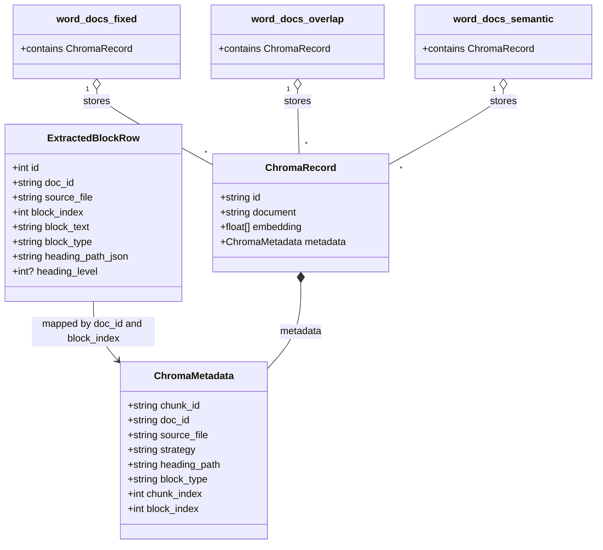

# Database Schema Overview

Tai lieu nay mo ta ro cau truc du lieu cua he thong, gom:
- SQLite (luu block tho sau khi extract DOCX)
- Chroma Vector DB (luu chunk + embedding + metadata)

## 1) SQLite Schema

Bang duy nhat: `extracted_blocks`

| Column | Type | Required | Mo ta |
|---|---|---|---|
| `id` | INTEGER (PK, AUTOINCREMENT) | yes | Khoa chinh noi bo cua SQLite |
| `doc_id` | TEXT | yes | ID tai lieu duoc sinh khi goi `/extract` |
| `source_file` | TEXT | yes | Ten file `.docx` nguon |
| `block_index` | INTEGER | yes | Vi tri block trong tai lieu goc |
| `block_text` | TEXT | yes | Noi dung block da normalize |
| `block_type` | TEXT | no | Loai block: `heading`, `paragraph`, `list_item`, `table` |
| `heading_path` | TEXT | no | JSON string cua danh sach heading path |
| `heading_level` | INTEGER | no | Cap heading neu la block heading |

---

## 2) Chroma Collections

He thong su dung 3 collections, moi collection ung voi mot strategy:
- `word_docs_fixed`
- `word_docs_overlap`
- `word_docs_semantic`

Moi record trong collection gom:
- `id`: `chunk_id`
- `document`: noi dung text cua chunk (`chunk_text`)
- `embedding`: vector embedding
- `metadata`: object key-value (chi tiet ben duoi)

---

## 3) Metadata fields trong Vector DB (Chroma)

### 3.1 Metadata duoc luu trong Chroma

Khi upsert vao Chroma, metadata thuc te duoc tao nhu sau:
- Tu `chunking`: `doc_id`, `source_file`, `strategy`, `heading_path`, `block_type`, `chunk_index`, `block_index`
- Bo sung luc upsert: `chunk_id`

Danh sach day du:

| Field | Type | Bat buoc | Vi du | Nguon |
|---|---|---|---|---|
| `chunk_id` | string | yes | `fixed_a1b2c3d4e5f6_0` | Them tai luc upsert (`{"chunk_id": c.chunk_id, **c.metadata}`) |
| `doc_id` | string | yes | `6811322529b2` | Sinh khi extract va truyen qua pipeline index |
| `source_file` | string | yes | `Hop_dong_A.docx` | Ten file goc |
| `strategy` | string | yes | `fixed` / `overlap` / `semantic` | Strategy index hien tai |
| `heading_path` | string | yes | `Chuong 1 > Dieu 2` | Join tu list heading bang `" > "` |
| `block_type` | string | yes | `paragraph` | Tu block parser |
| `chunk_index` | integer | yes | `0` | Thu tu chunk trong dot index |
| `block_index` | integer | yes | `12` | Vi tri block goc trong doc |

Luu y:
- Truong `heading_path` trong Chroma metadata la **string** (da join), khac voi trong model noi bo co the la `list[str]`.
- Cac truong metadata tren duoc su dung de filter va debug (vi du filter theo `doc_id` khi query).

### 3.2 Truong co trong model nhung khong dua vao Chroma metadata

`ChunkRecord` con co cac thong tin sau, nhung khong duoc dua vao `metadata` object khi upsert:
- `heading_level`
- `token_count`
- `strategy`/`doc_id`/`source_file`/... da co trong metadata nhu bang tren

---

## 4) Class diagram du lieu he thong

---

## 5) Giai thich cac truong bang vi du

Muc nay giai thich cac truong ban yeu cau bang mot tai lieu gia lap.

### 5.1 Tai lieu mau

Gia su file `.docx` co noi dung theo dung thu tu sau:

1. `Heading 1: Chuong 1`
2. `Paragraph: Ben A co nghia vu ...`
3. `Paragraph: Ben B co nghia vu ...`
4. `Heading 2: Dieu 1 - Thanh toan`
5. `Paragraph: Thanh toan trong 30 ngay`
6. `Table: Dot 1 | 50%, Dot 2 | 50%`

### 5.2 Giai thich truong trong SQLite Schema

#### a) `block_index`

`block_index` la vi tri block trong tai lieu goc, dem tu `0` theo thu tu parser doc duoc.

| Noi dung block | block_index |
|---|---|
| Heading 1: Chuong 1 | 0 |
| Paragraph: Ben A co nghia vu ... | 1 |
| Paragraph: Ben B co nghia vu ... | 2 |
| Heading 2: Dieu 1 - Thanh toan | 3 |
| Paragraph: Thanh toan trong 30 ngay | 4 |
| Table: Dot 1 \| 50%, Dot 2 \| 50% | 5 |

#### b) `block_type`

`block_type` la loai block parser nhan dien:
- heading
- paragraph
- list_item
- table

Vi du tren:
- `Heading 1: Chuong 1` -> `block_type = "heading"`
- `Paragraph: Ben A ...` -> `block_type = "paragraph"`
- `Table: Dot 1 ...` -> `block_type = "table"`

#### c) `heading_path`

`heading_path` mo ta duong dan heading hien tai cua block.
Trong SQLite, truong nay luu dang JSON string.

Vi du:
- Block `Heading 1: Chuong 1` -> `heading_path = ["Chuong 1"]`
- Block `Paragraph: Ben A ...` (nam duoi Chuong 1) -> `heading_path = ["Chuong 1"]`
- Block `Heading 2: Dieu 1 - Thanh toan` -> `heading_path = ["Chuong 1", "Dieu 1 - Thanh toan"]`
- Block `Paragraph: Thanh toan trong 30 ngay` -> `heading_path = ["Chuong 1", "Dieu 1 - Thanh toan"]`

#### d) `heading_level`

`heading_level` chi co y nghia voi block la heading, va duoc lay theo **style Heading trong Word**:
- Heading 1 -> `heading_level = 1`
- Heading 2 -> `heading_level = 2`
- Heading 3 -> `heading_level = 3`
- Block khong phai heading -> `heading_level = null`

Vi du:
- `Heading 1: Chuong 1` -> `heading_level = 1`
- `Heading 2: Dieu 1 - Thanh toan` -> `heading_level = 2`
- `Paragraph: Ben A ...` -> `heading_level = null`

Luu y quan trong:
- `heading_level` **khong** duoc suy ra truc tiep tu so thu tu hien thi nhu `5`, `5.1`, `5.2`.
- No duoc suy ra tu style cua doan (`Heading 1/2/3/...`).

Vi du voi cach danh so ban dua:
- `5. Noi dung quy trinh` co the la `heading_level = 1` neu style la Heading 1.
- `5.1 Luu do quy trinh` thuong la `heading_level = 2` neu style la Heading 2.
- `5.2 Dien giai quy trinh` se la `heading_level = 2` (khong phai 3) neu van de style Heading 2.
- Muon thanh `heading_level = 3`, doan do phai dung style Heading 3 (vi du `5.2.1 ...` neu quy uoc tai lieu nhu vay).

### 5.3 Giai thich truong trong Chroma Collections

#### `chunk_index`

`chunk_index` la thu tu chunk trong mot lan index (dem tu `0`), khong phai vi tri block trong doc.

Vi du voi strategy `fixed`:
- Block `block_index = 1` co text dai, bi cat thanh 2 chunks:
  - chunk A -> `chunk_index = 0`, `block_index = 1`
  - chunk B -> `chunk_index = 1`, `block_index = 1`
- Block `block_index = 2` cat thanh 1 chunk:
  - chunk C -> `chunk_index = 2`, `block_index = 2`

=> Mot `block_index` co the map toi nhieu `chunk_index` (nhat la fixed/overlap).

